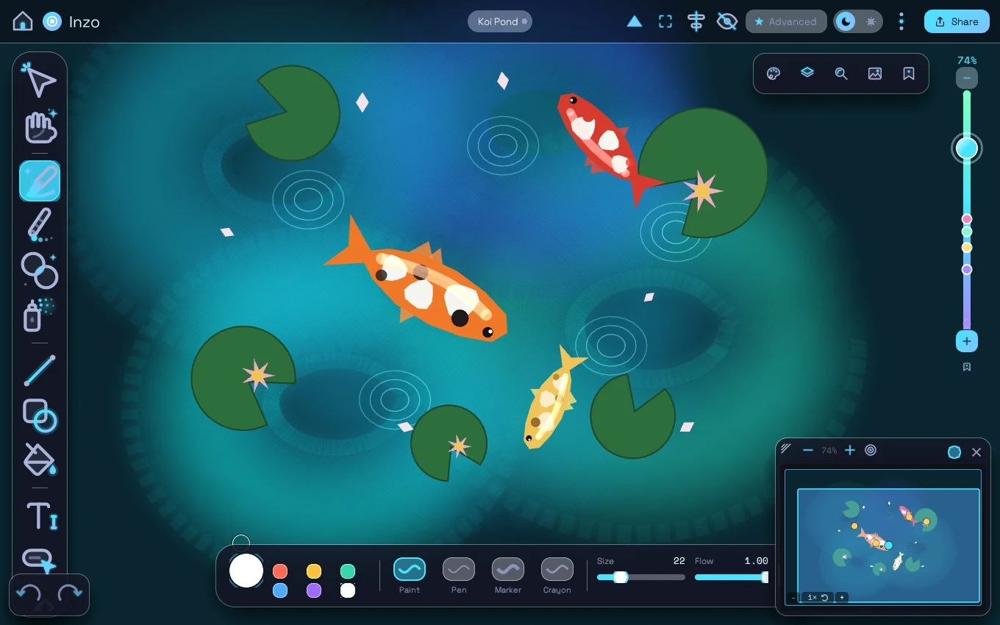

# inzo-site

The marketing website for **[Inzo](https://github.com/bsteinfeld/inzo)** — an
endless canvas you can dive into, forever.

**Live site:** https://bsteinfeld.github.io/inzo-site/



## What's here

```
site/
├── index.html    # the classic page: endless-zoom hero, live mini-Inzo demo,
│                 # real app screenshots, features, Google Play CTA
├── dive.html     # the scroll-dive version: scrolling IS zooming — each
│                 # section lives ×24 deeper than the last
└── assets/       # real screenshots of the app (WebP)
```

Both pages are fully self-contained static HTML — no build step, no framework,
no dependencies. The design mirrors the app itself: glass panels floating over
one infinite canvas, the night (cyan on space navy) and day (coral on cream)
palettes from the app's `theme.rs`, and a dive rail of bookmarks for
navigation.

## Local preview

```sh
cd site
python3 -m http.server 8000
# open http://localhost:8000        (classic)
# open http://localhost:8000/dive.html  (scroll-dive)
```

## Deployment

Pushes to `main` that touch `site/**` are deployed to GitHub Pages
automatically by [`.github/workflows/pages.yml`](.github/workflows/pages.yml)
(Pages source must be set to **GitHub Actions** in the repo settings).

## ⚠️ Don't edit the site here

The source of truth is the [`site/` folder in the main `inzo`
repo](https://github.com/bsteinfeld/inzo/tree/main/site). A workflow there
syncs any change merged to `main` under `/site` into this repo, which then
redeploys Pages. Changes made directly here will be overwritten by the next
sync.
